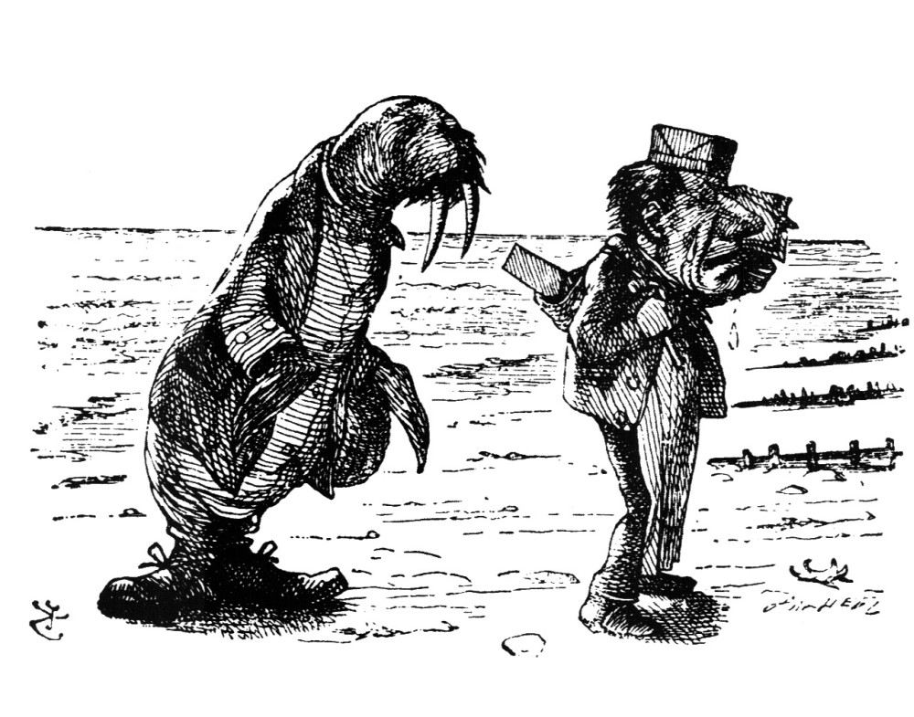

>  Of shoes — and ships — and sealing-wax —
>  Of cabbages — and kings —
>  And why the sea is boiling hot —
>  And whether pigs have wings.'

From *The Walrus and the Carpenter* by Lewis Carroll 


Someone once said: If you can't explain it, you don't understand it well enough. To put it differently: You understand things better once you start explaining it. This is one of my motivations to start blogging, to understand more on the topics I'm interested in.  Also, I want to use this blog to complete the thought process of many of my have backed ideas. Last but not least, I want to join the vibrant community of `R` users, open source enthusiasts, spatial people, python lovers, linux advocates and data scientists.

My Name is Nils Ratnaweera and I'm a Research Fellow at the Zurich University of Applied Sciences. I'm an environmental engineer who love his job of working with environmental spatial data using mainly open source tools such as `R`, `python`, `gdal`.




```{r setup, include=FALSE}
knitr::opts_chunk$set(echo = FALSE)
```
