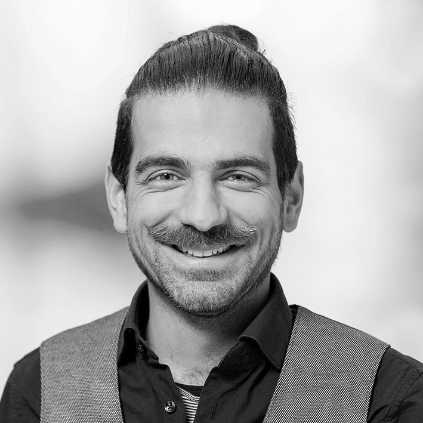
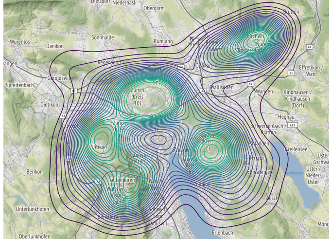
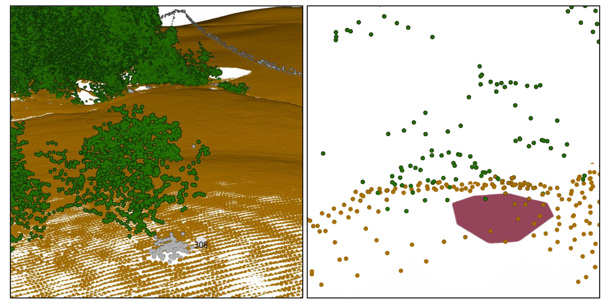

```{r, echo = FALSE}
library(fontawesome)
```


<link rel="stylesheet" href="resume-style.css">

Aside
================================================================================




Contact Info {#contact}
--------------------------------------------------------------------------------

- <i class="fa fa-envelope"></i> nils@ratnaweera.net
- <i class="fa fa-phone"></i> +41 79 220 5321
- `r fa("laptop-code")` [nils.ratnaweera.net](https://nils.ratnaweera.net/)
- <i class="fa fa-github"></i> [github.com/ratnanil](https://github.com/ratnanil)
- <i class="fa fa-github"></i> [github.zhaw.ch/rata/](https://github.zhaw.ch/rata/)
- [zhaw.ch/en/about-us/person/rata](https://www.zhaw.ch/en/about-us/person/rata/)

Skills {#skills}
--------------------------------------------------------------------------------


<ul>
  <li class = "skills">Geodata analysis, modelling and visualisation with R, Python, ArcGIS, QGIS, PostGIS, gdal</li>
  <li class = "skills">Spatial-R: sf, terra, sp, raster</li>
  <li class = "skills">Spatial-Py: geopandas, rasterio</li>
  <li class = "skills">Project management in various roles (project lead, supervisor, collaborator)</li>
  <li class = "skills">Reproducible reporting with RMarkdown, Jupyter Notebook, HTML, CSS, LaTeX</li>
  <li class = "skills">Regex, Webscraping, Network analysis, git / GitHub, CI/CD</li>
</ul>

<!-- - <i class="far fa-check-square"></i>  R: tidyverse, bookdown, blogdown, sf, spatstat, (rgdal) -->
<!-- - <i class="far fa-check-square"></i>  Python: Jupyterlab, -hub, -book, geopandas, (numpy) -->

Main
================================================================================

Nils Ratnaweera {#title}
--------------------------------------------------------------------------------

Formal education {data-icon=graduation-cap data-concise=true}
--------------------------------------------------------------------------------

### Master of Science ZFH in Life Sciences, Specialisation in Natural Ressource Sciences

Zurich University of Applied Sciences (ZHAW)

N/A <!-- Wädenswil -->

2017 - 2014

Master Thesis: Analysing flight behaviour of roe deer (*Capreolus capreolus*) using GPS and accelerometer data

### Bachelor of Science in Natural Resource Sciences, Specialisation in Nature Management

Zurich University of Applied Sciences (ZHAW)

N/A <!-- Wädenswil -->

2013 - 2009

Bachelor Thesis: *Analysing wildcat habitat connectivity in the prealps*


### Commercial apprenticeship (Kaufmännische Lehre mit Berufsmatura)

AXA Winterthur

N/A <!-- Kloten -->

2006 - 2003


Employment {data-icon=suitcase}
--------------------------------------------------------------------------------

### Research fellow ZHAW

Permanent position in the Geoinformatics Research Group

N/A <!-- Wädenswil -->

now - 2019

<!-- ::: concise -->
- Working on research projects as a *spatial data scientist* using R, Python, SQL, ArcGIS and QGIS to analyse geodata
- Project leader
- Teaching GIS, R and Python to bachelor and master students
<!-- ::: -->

### Research assistant ZHAW

Temporary position in the Geoinformatics Research Group

N/A <!-- Wädenswil -->

2019 - 2016

<!-- ::: concise -->
- Working on research projects as a *spatial data analyst* using R, Python, SQL, ArcGIS and QGIS to analyse geodata
- Teaching GIS and R to bachelor students
<!-- ::: -->


### Deputy project lead (part time)

Wiesel & Co am Zimmerberg

N/A <!-- Bezirk Horgen -->

2021 - 2013

<div class = "concise">
Responsible for:
<ul>
<li>GIS</li>
<li>Applied research</li>
<li>IT infrastructure (Server, Website, Database, Django-Application...)</li>
</ul>
</div>

### Cunsultant aviation insurances

AXA Winterthur Aviation insurances

N/A

- Offer insurance coverage of single aircraft and fleets
- Issue contracts and certificates and calculate premiums
- Develop automation tools

2008 - 2006


Portfolio {data-icon=images .page-break-before}
--------------------------------------------------------------------------------

Much of my recent work is publicly accessible. Some project highlights (<i class="fa fa-eye"></i> refers to the report, <i class="fa fa-github"></i> to the source code):

### Evaluating the project *Wiesel & Co am Zimmerberg*

Evaluating the success of measures implemented by *Wiesel & Co am Zimmerberg* by monitoring multiple locations and analysing datasets from different sources. <br> 
<i class="fa fa-eye"></i> [erfolgskontrolle.wieselundco.ch](https://erfolgskontrolle.wieselundco.ch/) <br> <i class="fa fa-github"></i> [github.com/wieselundco](https://github.com/wieselundco)
<br><br>
My contribution as project lead: 

N/A

2021 - 2019


<ul>
<li> Planning and execution of the sampling design </li>
<li> Combining and analysing data from different sources </li>
<li> Evaluating and visualizing results, writing the report</li>
</ul>

::: aside

:::


### Python and R for Environmental Scientists (BA / MA)

Teaching Python and R in the context of GIS and spatial data science to bachelor and master students: <br> <i class="fa fa-eye"></i> *Applied Geoinformatics*: [Modul-AGI.github.io](https://modul-agi.github.io/)<br><i class="fa fa-eye"></i> *Research Methods*: [ResearchMethods-ZHAW.github.io](https://researchmethods-zhaw.github.io) <br> <i class="fa fa-eye"></i> *CMA*: [ComputationalMovementAnalysis.github.io](https://computationalmovementanalysis.github.io)
<br><br>
My contribution: 

N/A

2021 - 2016

<ul> 
<li> Teaching the theory and concepts (module *Applied Geoinformatics*) </li>
<li> Developing and publishing the exercises,  providing sample solutions</li>
<li> Mentoring, supervising and grading projects</li>
</ul>

::: aside

:::


### Detecting micro habitat structures with LiDAR

Initiating and supervising a bachelorthesis to develop a method which detects micro habitat structures (wood piles) with LiDAR (swissSurface3D) in order to model habitat quality / connectivity for least weasels and stoats. <br><i class="fa fa-eye"></i> [bit.ly/3FU2rgz](https://bit.ly/3FU2rgz)
<br><br>
My contribution: 

N/A

2020

<ul>
<li> Formulating research questions and goals </li>
<li> Mentoring and supervising the student, providing technical input</li>
</ul>

::: aside

:::

### Preventing wildlife vehicle collisions

Modelling the risk of wildlife vehicle collision for the whole of Switzerland based on collision reports from three different cantons. <i class="fa fa-eye"></i> [zhaw.ch/iunr/wildtierunfaelle](https://www.zhaw.ch/iunr/wildtierunfaelle) <br> <i class="fa fa-eye"></i> [mobilityplatform.ch](https://www.mobilityplatform.ch/fileadmin/mobilityplatform/normenpool/21791_1698_Inhalt.pdf) <br><i class="fa fa-github"></i> [github.zhaw.ch/ASTRA](https://github.zhaw.ch/ASTRA)<br>
<br><br>
My contribution: 

N/A

2020 - 2015


<ul>
<li> Processing accident reports (determine species information with NLP, geolocating data and map matching) </li>
<li> Spatial modelling of hotspots and accident related parameters</li>
<li> Spatial comparison of model predictions</li>
</ul>

::: aside

:::

