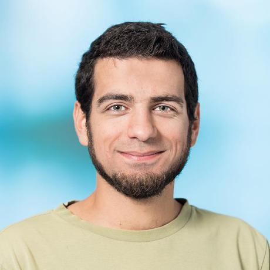

I understand something better once I try to explain it. This is one of my motivations to start blogging: to understand more on the topics I'm interested in. 

Also, publishing something helps me complete the thought process of half baked ideas. And last but not least, I want to join the vibrant community of `R` users, open source enthusiasts, spatial people, python lovers, linux advocates and data scientists.

My Name is Nils Ratnaweera and I'm a Research Fellow at the Zurich University of Applied Sciences. I'm an environmental engineer who love his job of working with environmental spatial data using mainly open source tools such as `R`, `python`, `gdal`, `SQL`.

<!--  -->

